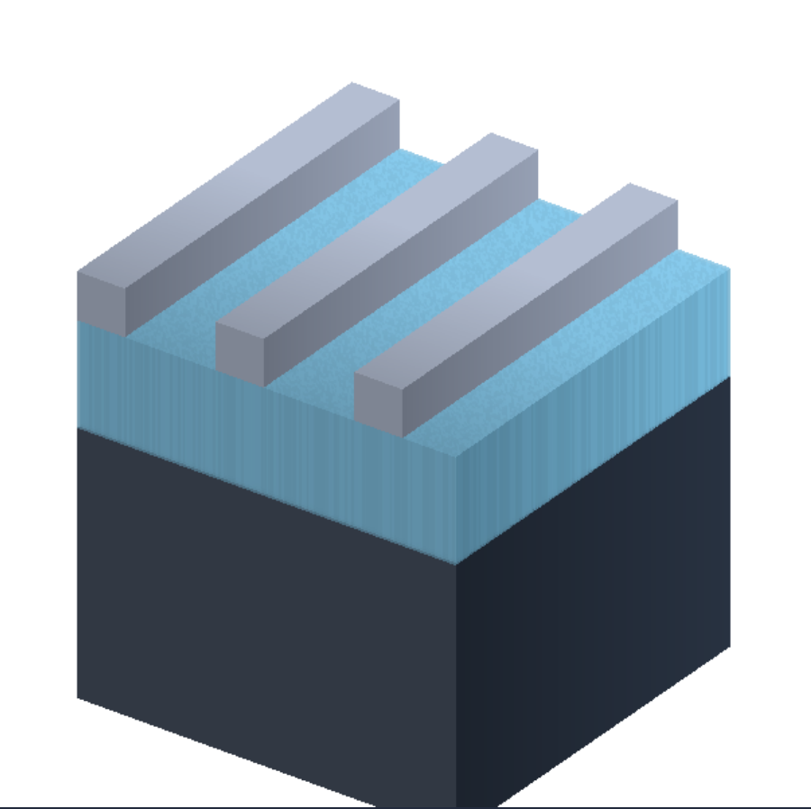
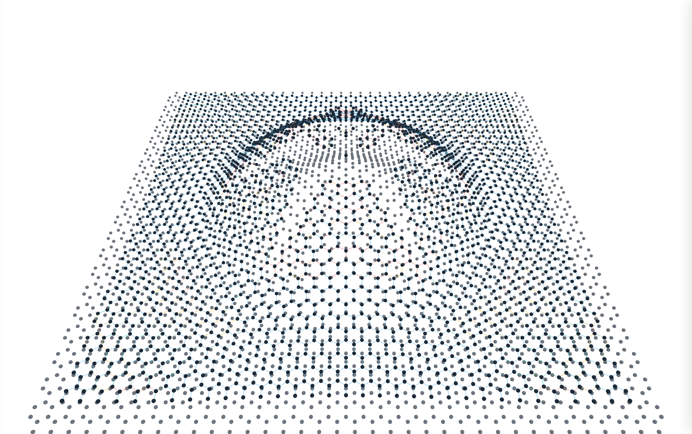

# DSW — Digital Science Workstation

A small, polished host that runs **DEX** (digital experiment) plugins — native
C++ simulation cores with HTML/JS front-ends. Installing an experiment is
dropping a folder into `plugins/`; the browser is the GUI; the heavy math runs
native.

```
        browser (GUI)                      dsw host (native)
  ┌──────────────────────┐   WebSocket   ┌──────────────────────────────┐
  │ plugin's ui/index.html│◄────────────►│ session worker thread        │
  │  + /dex.js shim       │  JSON ctrl   │   └─ your C++ core           │
  │  canvas ◄─ RGBA frames│  bin frames  │      (OpenMP / SIMD / GB RAM)│
  └──────────────────────┘               └──────────────────────────────┘
```

## Why a plugin format of its own?

Mature plugin standards already exist, and they are ordinary shared libraries
that no host limits in memory or threading — so one of them *would* load a
simulation. The problem is that each is shaped around the field it grew up in:
you would implement fixed data buses and a realtime `process()` callback you do
not want, squeeze state through parameters normalised to 0–1, embed your GUI
through per-platform view plumbing, and ship someone else's licensed SDK.

DSW keeps the two properties worth keeping — **a tiny stable binary ABI** and
**drop-in-folder installation** — and discards the rest. The whole plugin
contract is one header, [`include/dex_plugin.h`](include/dex_plugin.h), with
seven functions.

## Build & run

Needs CMake ≥ 3.15 and a C++17 compiler (OpenMP optional but recommended).
[`SETUP.md`](SETUP.md) walks through installing those on Windows, macOS and
Linux — and LAMMPS alongside them, if you want a reference implementation to
check the molecular dynamics against. If you only want to *run* the
experiments, skip all of this and take a
[release build](https://github.com/DEX-2DPHYS/dex-2dphys.github.io/releases)
instead.

```sh
cd dsw
cmake -B build -DCMAKE_BUILD_TYPE=Release
cmake --build build -j
./dsw                  # open http://127.0.0.1:8090/
```

On Windows (MSVC, from any writable directory — not an admin shell's
`C:\Windows\System32`):

```powershell
cd dsw
cmake -B build
cmake --build build --config Release
.\dsw.exe              # open http://127.0.0.1:8090/
```

The host binds **localhost only** and serves the launcher, each plugin's
`ui/` folder, and one WebSocket per running experiment. `./dsw --help` lists
`--port`, `--plugins DIR`, `--web DIR`.

## The launcher

The launcher is a workstation window: a VSCode-style tree on the left, the
running experiment embedded on the right (or in its own tab), three visual
themes (Editorial — the default white; Executive — dark; Studio — glassy
blue), and a settings pane for the plugin folder.

Plugins come from **two roots**, both rescanned on every refresh:

- **Built-in** — the `plugins/` folder beside the host, where the four
  example experiments live.
- **Library** — your own plugin folder. Like any plug-in directory it has a
  standard home, **`Documents/DSW Plugins`** (created on first run), and can
  be repointed from the launcher's *Plugin folder…* pane; the choice is
  remembered per user in `%APPDATA%/DSW/settings.json`
  (`~/.config/dsw/settings.json` on Linux/macOS). `--plugins DIR` overrides
  it for one run without persisting.

Subfolders inside either root are shown as folders in the tree, so a library
organised on disk as `Waves/…`, `Chaos/…`, `Teaching/…` appears exactly that
way in the launcher. A folder is treated as a plugin bundle (a leaf) as soon
as it contains `dex.json`, a matching binary, or `ui/index.html`; anything
else is a category and is scanned deeper. Bundle folder names are the
routing key, so they must be unique across both roots — a duplicate name is
dropped from the listing (built-ins win).

Ships with four example experiments:

| Plugin | What it shows |
|--------|---------------|
| `gray-scott` | Gray–Scott reaction–diffusion on a 512×512 torus: presets, F/k sliders, paint-to-seed brush, steps/s telemetry. |
| `wave-tank` | Damped 2D wave equation with absorbing shores and single/double-slit barriers: poke the water, drive an oscillator, watch interference fringes form. |
| `pattern-transfer` | Nanofabrication process-flow simulator on a 3D voxel cross-section: spin resist, EBL/UV exposure, contrast-curve development, deposition, RIE/wet/SF6 etch, lift-off — with undo-by-replay and a native painter-sorted isometric renderer. |
| `graphene-md` | Bilayer-graphene molecular dynamics: Morse C–C bonds that break and re-form, sp² angle stiffness, a bending umbrella and Lennard-Jones adhesion to a rigid substrate. Push a mesa, Gaussian bump or Hencky gas blister up and watch the sheet drape, wrinkle and tear. The core streams atom positions and bond topology; the browser keeps the WebGL scene. |

<p>
  
  
  
  
</p>

## Downloads & installing a plugin

A plugin is a compiled core, so there is no one file that works everywhere —
each platform needs its own build. Two ways to get one:

**Prebuilt.** The *DSW release* workflow (Actions tab → *Run workflow*, or
push a tag like `dsw-v1.0`) builds for Linux, macOS and Windows and produces:

| Archive | What it is |
|---------|------------|
| `dsw-<platform>.zip` | The whole workstation — host, launcher, every built-in experiment, this README and `SETUP.md`. Unzip and run; nothing to compile. The Windows archive also carries `Launch DSW.cmd` / `Stop DSW.cmd`, which start and stop the host and open the launcher for you. |
| `dsw-plugin-<id>-<platform>.zip` | One experiment on its own, to add to an existing install. |

Grab them from the run's *Artifacts*, or from the Release if you pushed a tag.
Release builds are compiled for a generic CPU so they run anywhere; building
yourself is faster, because a local build tunes for your own machine
(`-DDSW_NATIVE_ARCH=OFF` turns that off if you want to pass your build on).

**Installing one.** Unzip the bundle into your plugin library — the folder
the launcher shows under *Plugin folder…*, by default:

```
Windows   %USERPROFILE%\Documents\DSW Plugins\
macOS     ~/Documents/DSW Plugins/
Linux     ~/Documents/DSW Plugins/
```

so that it lands as `DSW Plugins/graphene-md/` containing `dex.json`, the
core (`graphene-md.dll` / `.so` / `.dylib`) and `ui/`. Hit refresh in the
launcher and it appears in the tree — no restart. Subfolders become
categories, so `DSW Plugins/Teaching/graphene-md/` works too.

A bundle folder's name is its routing key and must be unique across both
roots; if you install one that shadows a built-in, the built-in wins and the
copy is ignored. Nothing is registered globally — deleting the folder
uninstalls it.

## Anatomy of a plugin bundle

```
plugins/my-experiment/
├── dex.json               # launcher card: name, description, accent, version
├── my-experiment.so       # the compiled core (.dll on Windows, .dylib on mac)
├── ui/
│   └── index.html         # the front-end; only ui/ is web-visible
└── src/plugin.cpp         # source (optional, not served)
```

Installing = copying that folder into the plugin library (or any subfolder
of it) and refreshing the launcher. No registry, no manifest editing
anywhere else.

### The native side (7 functions)

```c
#include "dex_plugin.h"

void *create(void);                       // one browser tab = one instance
void destroy(void *inst);
int  advance(void *inst, double dt);      // called in a loop; return 0 = idle
void on_message(void *inst, const char *json, size_t len);  // UI -> core
const char *poll_message(void *inst);     // core -> UI, NULL when drained
int  render(void *inst, dex_frame *out);  // fill RGBA8, return 1

extern "C" DEX_EXPORT const dex_plugin_api *dex_plugin_entry(void) { ... }
```

The host serializes all calls for one instance onto one worker thread, so a
plugin needs **no locks** — and whatever it does internally (OpenMP loops,
thread pools, gigabytes of field data) is its own business. `render()` is
only called when the browser asks for a frame, so display pace and
simulation pace are decoupled: the sim runs flat out, the canvas gets at
most one frame per display refresh, and a slow sim never builds up latency.

[`include/dex_msg.h`](include/dex_msg.h) has small helpers for reading the
flat JSON control messages.

### The browser side

```html
<script src="/dex.js"></script>
<script>
  const dex = DEX.connect({
    canvas: document.getElementById("view"),  // frames auto-draw here
    onMessage(m) { /* JSON from the core */ },
  });
  dex.send({ t: "set", k: "feed", v: 0.034 });
</script>
```

`/dex.js` (served by the host) opens the WebSocket, paces frame requests
with `requestAnimationFrame`, and blits incoming RGBA frames to your canvas.
Message vocabulary is entirely yours — the host just relays JSON.

## Porting an HTML/JS DEX prototype

1. Copy the prototype page into `ui/index.html`; delete its simulation loop,
   keep its controls and styling.
2. Rewrite the inner loop in `src/plugin.cpp` (usually a near-transliteration
   of the JS, plus `#pragma omp parallel for` on the field loop).
3. Wire each control to `dex.send({t:"set", k:..., v:...})` and handle it in
   `on_message`; draw into the RGBA buffer in `render()`.
4. Add the folder to `CMakeLists.txt` (`dsw_add_plugin(my-experiment)`),
   build, refresh the launcher.

The shipped plugins are meant as templates — `wave-tank` for
click-interaction and mode switches, `gray-scott` for parameter sweeps and
brushes, `pattern-transfer` for event-driven experiments where the UI sends
discrete commands and the core keeps a replayable history, and `graphene-md`
for the case where the browser owns the rendering and the core streams it
packed geometry over the frame channel instead of pixels.

## Protocol (for the curious)

* `GET /api/plugins` — rescan `plugins/` and list bundles (this is what makes
  drop-in install work; the launcher calls it on every load).
* `GET /plugins/<id>/ui/...` — a bundle's static UI files. Only `ui/` is
  reachable; binaries, sources and `..` paths are refused.
* `WS /ws/<id>` — one experiment session. Text frames are JSON control
  messages both ways; the literal text `f` requests one frame; binary frames
  are `"DXF1"` + u32le width + u32le height + RGBA8.

Replacing a plugin **binary** while the host is running requires a host
restart (loaded libraries are cached); UI files and newly dropped bundles
are picked up on refresh.

## Portability

Linux and macOS build as-is. Windows (MSVC + CMake, Winsock/`LoadLibrary`
paths) is tested and working: host, launcher, both example plugins and the
frame-streaming WebSocket verified on Windows 11 / Visual Studio 2026.
